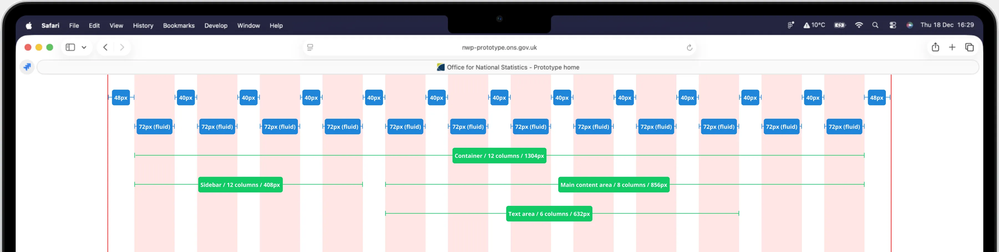
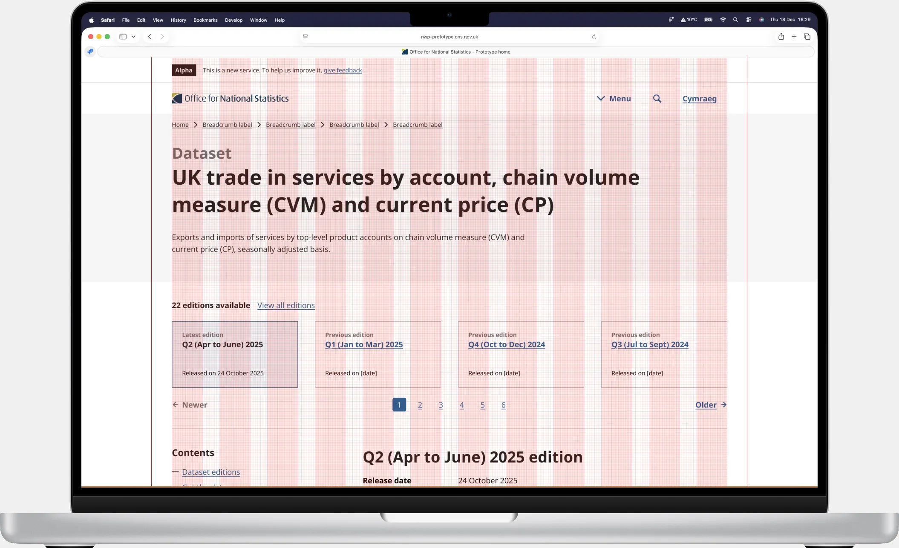

This section describes the layout principles used across the ONS website and explains the rationale behind the grid, container, outside margins, gutters and column decisions. While layout tokens define the raw values using in Figma, this section focuses on *how and why* those values are applied to create consistent, readable, and flexible page layouts.

## Grids

The layout system in build on an 8px layout grid, which is widely adopted across the industry and provides a strong foundation for consistent spacing and alignment. Using an 8px grid makes it easier to scale layouts across breakpoints, align components cleanly, and maintain predictable spacing between elements. It also supports collaboration between design and development, as values remain simple and repeatable.

Alongside this, typography follows a 4px baseline grid. This is used exclusively for text and typographic elements. A 4px baseline allows for finer control over line heights and vertical spacing, making it easier to balance readability and hierarchy across different text sizes. By halving the layout grid, we gain flexibility for typography without breaking the overall vertical rhythm of the page.

## Container

The layout system uses a responsive grid structure that adapts across different viewport sizes.

The grid provides a flexible foundation for arranging content while maintaining consistency across different page types. It supports a wide range of content, including navigation, editorial content, datasets, tables and data visualisations.

The number of columns changes depending on the available screen space to ensure content remains readable and layouts remain practical across devices.

### Desktop grid

On larger screens, the layout uses a 12-column grid. This provides flexibility for creating complex page structures, including sidebars, content areas, multi-column sections and data-rich layouts.

Columns can be combined to create different arrangements while maintaining consistent alignment across components and page sections.

### Tablet and mobile grids

As the available screen width reduces, the grid simplifies to support smaller layouts.

Tablet layouts use a three-column structure, providing enough flexibility for content while adapting to reduced horizontal space.

Mobile layouts use a single-column structure. This prioritises readability, vertical flow and ease of interaction on smaller screens.

### Gutters

Gutters provide the spacing between columns.

Consistent gutter spacing helps define relationships between different content areas and prevents pages from feeling visually dense. This is particularly important for content-heavy ONS pages that may contain multiple information types, such as navigation, datasets, tables, charts or supporting information.

The gutter size is designed to provide enough separation for users to distinguish between content areas while maintaining a coherent relationship between elements within the overall page layout.

### Outside margins

Outside margins provide space between the edge of the viewport and the page container.

This spacing creates separation between the content and the surrounding interface, helping pages feel balanced and easier to navigate. Without sufficient outside margin, content can appear visually crowded and harder to scan, particularly on larger screens where content may otherwise extend close to the edge of the viewport.

The amount of outside margin is intentionally designed to balance two needs:

* Providing enough whitespace to create a comfortable reading and viewing experience
* Making effective use of available screen space across different device sizes

Outside margins reduce at smaller viewport sizes to preserve usable content space while maintaining clear separation from the edge of the screen.

### Maximum container width

The layout uses a maximum container width to prevent content from becoming excessively wide on larger screens.

Without a maximum width, content can become more difficult to scan as reading distances increase and related elements become more visually disconnected from one another.

Constraining the layout helps maintain readability while still providing sufficient space for more complex page structures, such as sidebars, navigation, tables and data visualisations.

The container scales fluidly until the maximum width is reached.

Image goes here...

## Layouts

The layout system provides a flexible structure for arranging content across different page types.

Pages can use different combinations of layout regions depending on the purpose of the content. Common patterns include a primary content area, supporting navigation, supplementary information, or multi-column content.

The grid provides the foundation for these layouts while allowing pages to adapt to different user needs and content types.

### Content areas

Content areas can be arranged using the available columns within the grid.

For example, a page may include:

* A primary content area for the main page content
* A supporting area for navigation, filters or related information
* Multiple columns for structured content or data visualisations

Not all pages require multiple content areas. Simpler pages may use a single content area that occupies the available width.

### Text content width

While the overall layout may provide space for wider content, long-form text should not span the full available width.

Research and accessibility guidance consistently show that excessively long line lengths can reduce reading speed, comprehension and scanning efficiency. To support readability, text content should typically be constrained to a maximum width of six columns (632px).

This allows the layout system to support wider page structures while maintaining comfortable reading patterns for users.

### Flexible layouts

The layout system is intended to provide structure rather than prescribe a single page composition.

Columns can be combined or divided as required to support different content types while maintaining alignment with the wider layout system. This flexibility allows pages to accommodate a range of needs, from long-form editorial content to data-heavy layouts and visualisations, without introducing new grid structures.

All layout dimensions scale fluidly with the viewport, ensuring layouts remain proportionate across different screen sizes.

## Responsive behaviour

The layout adapts responsively to different viewport sizes while preserving the same underlying principles.

On tablet-sized viewports (up to 768px wide), the layout switches to a three-column grid. This provides sufficient flexibility for content while recognising the reduced horizontal space available.

On mobile-sized viewports (up to 480px wide), the layout collapses to a single-column layout. This supports vertical stacking of content and prioritises readability and ease of interaction on narrow screens.

At smaller breakpoints, the sidebar and main content typically stack vertically, following the natural reading order.

## Layout sizes and breakpoints

| Property                 | Desktop               | Tablet  | Phone   |
|--------------------------|-----------------------|---------|---------|
| Maxmimum container width | 1304px                | Fluid   | Fluid   |
| Columns                  | 12                    | 3       | 1       |
| Column gutter            | 40px                  | 40px    | N/A     |
| Outside margin           | 48px                  | 32px    | 24px    |
| Sidebar width            | 4 columns (max 408px) | Stacked | Stacked |
| Main content width       | 8 columns (max 856px) | Stacked | Stacked |
| Max text width           | 6 columns (max 632px) | Fluid   | Fluid   |
| Layout grid              | 8px                   | 8px     | 8px     |
| Typography grid          | 4px                   | 4px     | 4px     |